# Investigando relação entre vitória do time mandante e estatísticas de partidas da Premier League

# Introdução

Talvez quem criou o futebol não esperasse que o esporte viesse a ter a relevância de hoje em dia. Criado em 1863, na Inglaterra, o futebol é baseado em um simples objetivo para vencer: marcar mais gols que seu adversário.

Entretanto, não é tão simples assim. Em campo estão 22 jogadores, 11 de cada lado, que podem mudar uma partida com uma simples ação, seja ela uma defesa, ou carrinho ou até mesmo um chute que vai parar na arquibancada. Tudo é relevante no futebol, especialmente na liga mais organizada, famosa e discutivelmente, a mais disputada, do mundo, a Premier League, o Campeonato Inglês.

Embora possua esse nome hoje, o Campeonato Inglês foi criado em 1888 sob o nome de Football League, vindo a se chamar Premier League apenas em 1992, após os clubes se organizarem a fim de buscarem aumentar suas receitas. 

O berço do futebol mundial conta com fãs apaixonados ao redor do mundo, o atual campeão europeu, o Chelsea, e estrelas mundiais como Cristiano Ronaldo, Kanté, Kevin de Bruyne, Virgil Van Dijk e afins. Outras estrelas da liga são os técnicos, que muitas vezes revolucionam o futebol, seja na própria Inglaterra ou em outros países. Muitos destes, apresentam esquemas táticos e formas de jogar diferenciadas, resultando em estatísticas diferentes, mas com um mesmo objetivo: vencer.

Uma das facilidades para se vencer um jogo, ainda que externa, é jogar em casa. Durante a pandemia de COVID-19, ocorreram 190 jogos na Premier League, sendo 37,2% destes vencidos pelo time visitante. Antes da pandemia, em 288 jogos, os visitantes haviam vencido apenas 30,2% das partidas. Uma série de outras estatísticas também foram alteradas devido a não presença de público. 

Nos últimos anos, uma nova pratica está ganhando força: apostas online em jogos esportivos, como o futebol. A aposta mais comum é a de vitória de um certo time e, dependendo do confronto, a aposta é teóricamente fácil, pois o nível técnico dos jogadores de um time ou o poder aquisitivo é muito superior a do adversário. Porém, na principal liga do mundo, há muitos times que podem surpreender, assim como o Leicester, campeão em 2016, o que acaba gerando perda para os apostadores e grande lucro para as casas de apostas, uma vez que ainda que mais apostadores apostam numa odd (chance) baixa, que numa odd alta.

Sites como o bet365, dona de um dos times da Inglaterra, o Stoke City, popularizaram esses tipos de apostas, e já contam com diversas opções, como quantidade de escanteios, cartões, gols, apostas individuais, etc. Mesmo com esse leque de opções, a principal aposta ainda é a aposta em quem vai vencer. Há diversas estatísticas, inclusive ao vivo, que podem ajudar a identificar quem será o vencedor, e saber quais são as mais relevantes e o grau de relevância é de interesse geral dos apostadores.

A análise deste estudo irá verificar 3841 partidas da Premier League entre 2010 e 2021, com o Objetivo sendo identificar se o time mandante venceu o jogo, baseado em estatísticas da própria partida.

# Análises descritivas

Essas análises foram baseadas apenas nas estatísticas do time mandante

Aparenta haver uma pequena diferença, quando observamos as medianas, entre os resultados, onde os mandantes que perderam tendem a dar menos chutões do que os que venceram ou empataram.
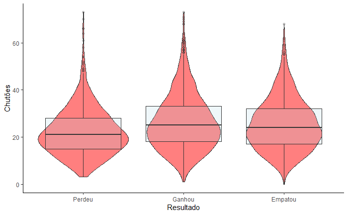

Quando o mandante perde, os escanteios aparentam ocorrer em menor número.
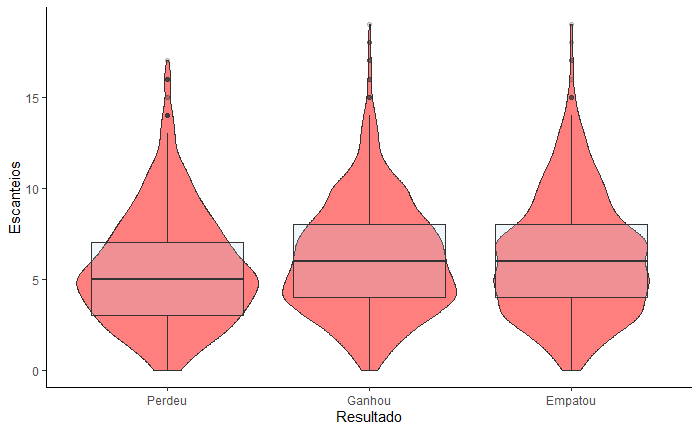

Times mandantes que ganharam, parecem possui uma quantidade de faltas cometidas um pouco menor que os demais resultados.
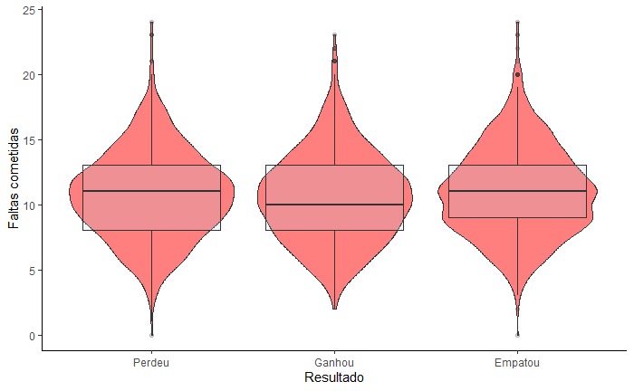

Nenhuma diferença pode ser percebida na quantidade de impedimentos.
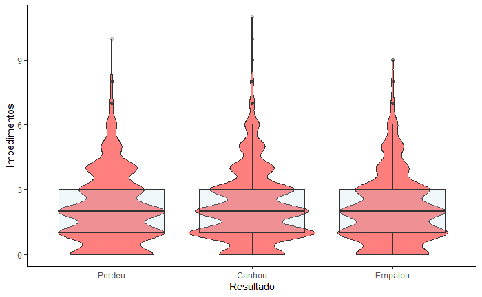

Times mandantes que ganharam, parecem possuir mais passes realizados durante a partida.
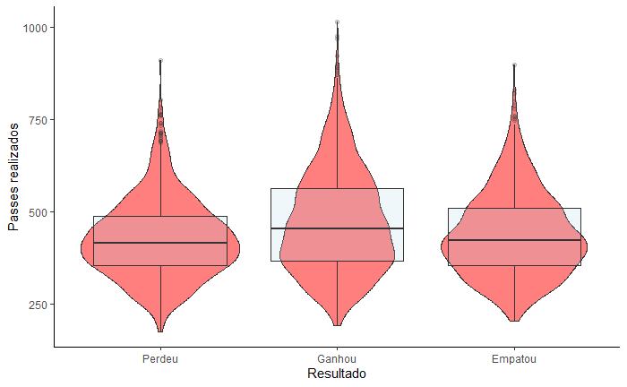

Posse de bola do mandante vencedor aparenta ser um pouco maior que os demais resultados.
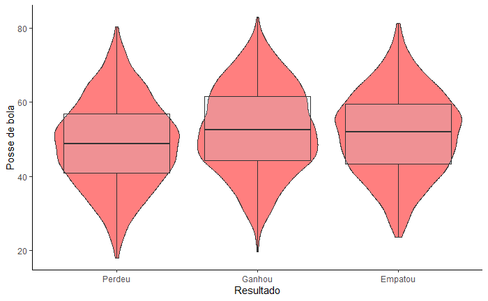

Quando há ocorrência de 2 cartões vermelhos, o time mandante tende a perder.
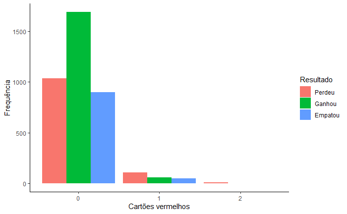

Times que venceram aprentar dar mais chutes.
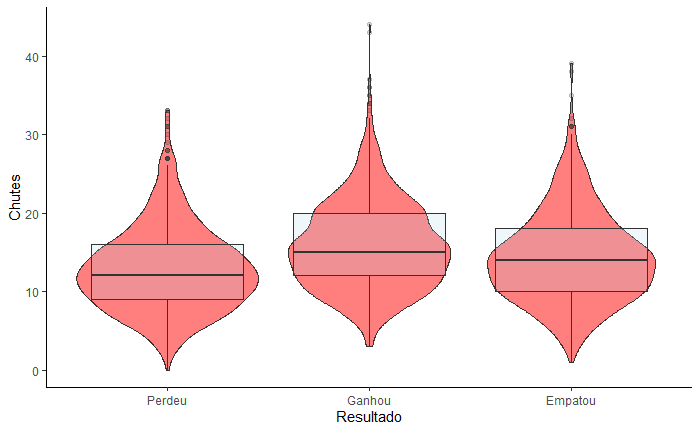

Dar mais chutes no gol aparenta influenciar positivamente na vitória.
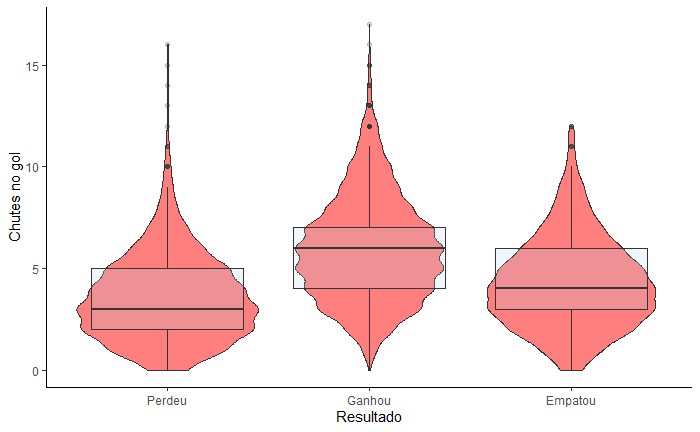

A quantidade de roubadas de bola não aparenta influenciar no resultado.
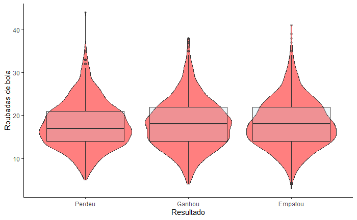

Times que venceram tendem a possuir maior quantidade de toques na bola durante a partida.
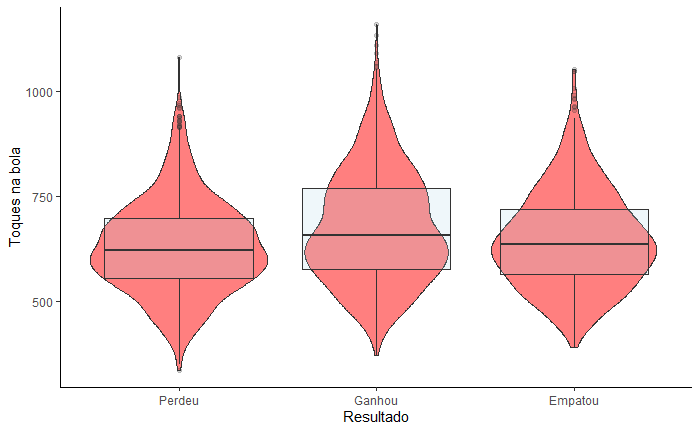

Comportamento semelhante entre os resultados, não parece interferir na vitória
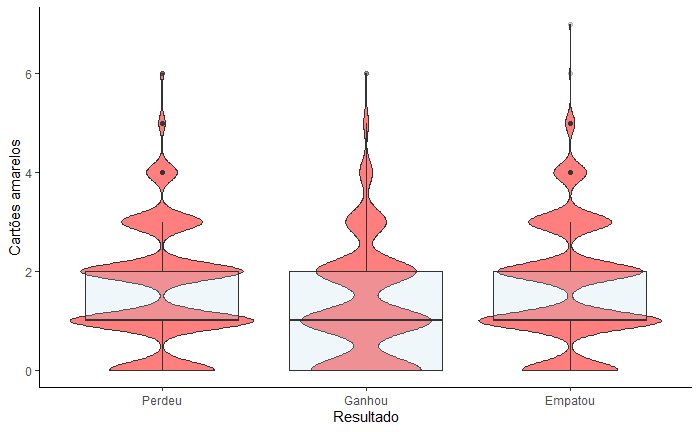

# Probabilidades

* ## Chutões
* A cada chutão do time mandante, a chance do time mandante ganhar diminui em 9% em relação ao resultado de empate
* A cada chutão do time mandante, a chance do time mandante ganhar diminui em 5% em relação ao resultado de derrota
* A cada chutão do time visitante, a chance do time mandante ganhar aumenta em 7% em relação ao resultado de empate
* A cada chutão do time visitante, a chance do time mandante ganhar aumenta em 5% em relação ao resultado de derrota
* ## Escanteio
* A cada escanteio do time mandante, a chance do time mandante ganhar diminui em 7% em relação ao resultado de empate
* A cada escanteio do time mandante, a chance do time mandante ganhar diminui em 2% em relação ao resultado de derrota
* A cada escanteio do time visitante, a chance do time mandante ganhar aumenta em 5%  em relação ao resultado de empate
* A cada escanteio do time visitante, a chance do time mandante ganhar aumenta em 3% em relação ao resultado de derrota
* ## Faltas Cometidas
* A cada falta cometida pelo time mandante, a chance do time mandante ganhar aumenta em 2%  em relação ao resultado de empate
* A cada falta cometida pelo time mandante, a chance do time mandante ganhar aumenta em 1% em relação ao resultado de derrota
* A cada falta cometida pelo time visitante, a chance do time mandante ganhar diminui em 2%  em relação ao resultado de empate
* A cada falta cometida pelo time visitante, a chance do time mandante ganhar aumenta em 2% em relação ao resultado de derrota
* ## Impedimentos
* A cada impedimento do time mandante, a chance do time mandante ganhar diminui em 5%  em relação ao resultado de empate
* A cada impedimento do time mandante, a chance do time mandante ganhar diminui em 7% em relação ao resultado de derrota
* A cada impedimento do time visitante, a chance do time mandante ganhar aumenta em 1%  em relação ao resultado de empate
* A cada impedimento do time visitante, a chance do time mandante ganhar aumenta em 2% em relação ao resultado de derrota
* ## Passes
* A cada passe do time mandante, a chance do time mandante ganhar diminui em 4%  em relação ao resultado de empate
* A cada impedimento do time mandante, a chance do time mandante ganhar diminui em 3% em relação ao resultado de derrota
* A cada passe do time visitante, a chance do time mandante ganhar aumenta em 3%  em relação ao resultado de empate
* A cada impedimento do time visitante, a chance do time mandante ganhar aumenta em 1% em relação ao resultado de derrota
* ## Cartões Vermelho
* a cada cartão vermelho do time mandante, a chance do time mandante ganhar aumenta em 566% em relação ao resultado de empate
* a cada cartão vermelho do time mandante, a chance do time mandante ganhar aumenta em 219% em relação ao resultado de derrota
* a cada cartão vermelho do time visitante, a chance do time mandante ganhar diminui em 64% em relação ao resultado de empate
* a cada cartão vermelho do time visitante, a chance do time mandante ganhar diminui em 44% em relação ao resultado de derrota
* ## Chutes
* a cada chute do time mandante, a chance do time mandante ganhar aumenta em 1% em relação ao resultado de empate
* a cada chute no alvo do time mandante, a chance do time mandante ganhar diminui em 42% em relação ao resultado de empate
* a cada chute do time visitante, a chance do time mandante ganhar diminui em 2% em relação ao resultado de empate
* a cada chute do time visitante, a chance do time mandante ganhar aumenta em 1% em relação ao resultado de derrota
* ## Chutes no Alvo
* a cada chute no alvo do time mandante, a chance do time mandante ganhar diminui em 42% em relação ao resultado de empate
* a cada chute no alvo do time mandante, a chance do time mandante ganhar diminui em 30% em relação ao resultado de derrota
* a cada chute no alvo do time visitante, a chance do time mandante ganhar aumenta em 182% em relação ao resultado de empate
* a cada chute no alvo do time visitante, a chance do time mandante ganhar aumenta em 122% em relação ao resultado de derrota
* ## Roubada de Bola
* a cada roubada de bola do time mandante, a chance do time mandante ganhar diminui em 2% em relação ao resultado de empate
* a cada roubada de bola do time mandante, a chance do time mandante ganhar diminui em 1% em relação ao resultado de derrota
* a cada roubada de bola do time visitante, a chance do time mandante ganhar diminui em 3% em relação ao resultado de empate
* a cada roubada de bola do time visitante, a chance do time mandante ganhar diminui em 3% em relação ao resultado de derrota
* ## Toques
* a cada toque na bola do time mandante, a chance do time mandante ganhar aumenta em 1% em relação ao resultado de empate
* a cada toque na bola do time mandante, a chance do time mandante ganhar aumenta em 2% em relação ao resultado de derrota
* a cada toque na bola do time visitante, a chance do time mandante ganhar aumenta em 1% em relação ao resultado de empate
* a cada toque na bola do time visitante, a chance do time mandante ganhar aumenta em 0.1% em relação ao resultado de derrota
* ## Cartões Amarelo
* a cada cartão amarelo recebido pelo time mandante, a chance do time mandante ganhar aumenta em 5% em relação ao resultado de empate
* a cada cartão amarelo recebido pelo time mandante, a chance do time mandante ganhar aumenta em 5% em relação ao resultado de derrota
* a cada cartão amarelo recebido pelo time visitante, a chance do time mandante ganhar aumenta em 2% em relação ao resultado de empate
* a cada cartão amarelo recebido pelo time visitante, a chance do time mandante ganhar aumenta em 4% em relação ao resultado de derrota
* ## Posse de Bola
* a cada 1% a mais de posse do time mandante, a chance do time mandante ganhar aumenta em 72% em relação ao resultado de empate
* a cada 1% a mais de posse do time mandante, a chance do time mandante ganhar aumenta em 34% em relação ao resultado de derrota

# Conclusão

Em geral, o que se percebe são comportamentos parecidos para as influências das estatísticas do mandante e do visitante. Isto é, se o aumento da estatística para o time mandante, aumenta a chance dela ganhar, então, o aumento da mesma estatística para o visitante diminui a chance do mandante ganhar.

A conclusão sobre os cartões vermelhos chama a atenção, não apenas pelos valortes altos, porém pelo fato de discordar da análise gráfica, testes de hipótese e do pensamento comum. Isto pode ser pelo fato de terem poucos casos de cartões vermelhos em uma partida olhando para todos os dados disponíveis, o que fez com que o modelo não medisse bem essa estatística.

Por fim foi possível identificar as estatística que mais influenciam no resultado de uma partida, sendo estas, o número de chutes no gol e a posse de bola. Aqui há de se tomar cuidado, pois apesar dessas estatísticas aumentarem bastante a probabilidade de ganhar, há outras estatística que aumentam pouco, porém aumenta este pouco a cada aumento da estatística. Por exemplo, a cada toque a chance de ganhar aumenta, mas em uma partida é comum termos mais de 400 toques, o que leva este valor a 400%.

